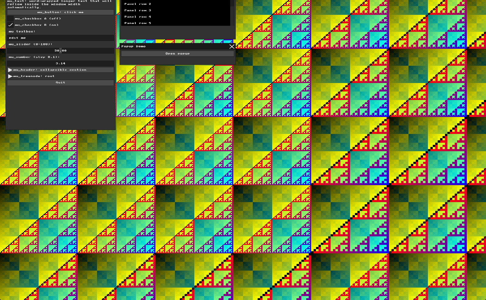
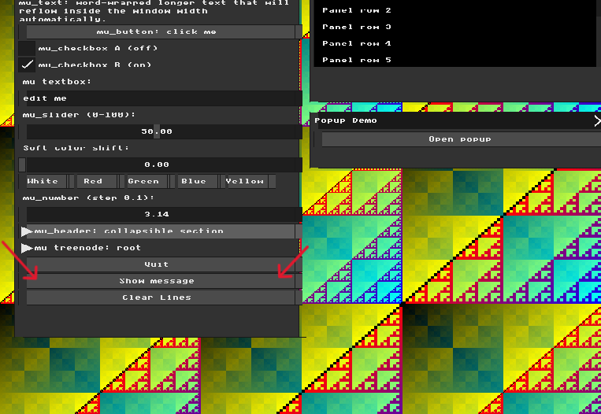
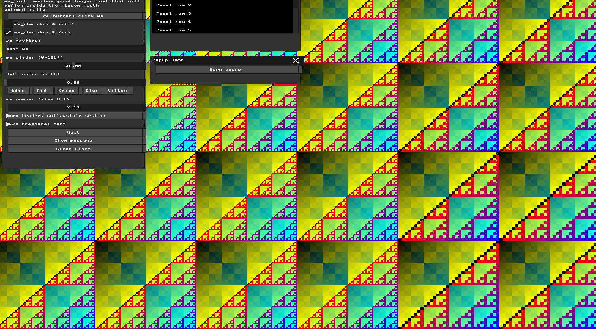
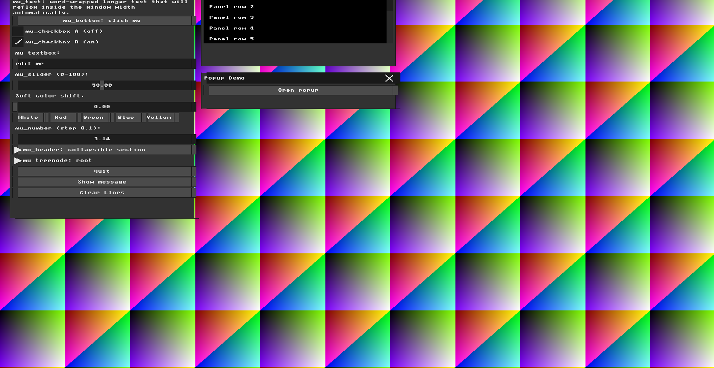
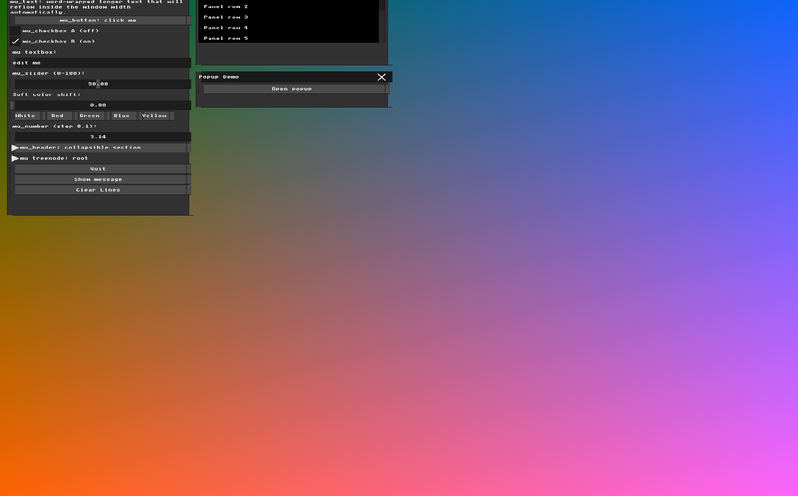
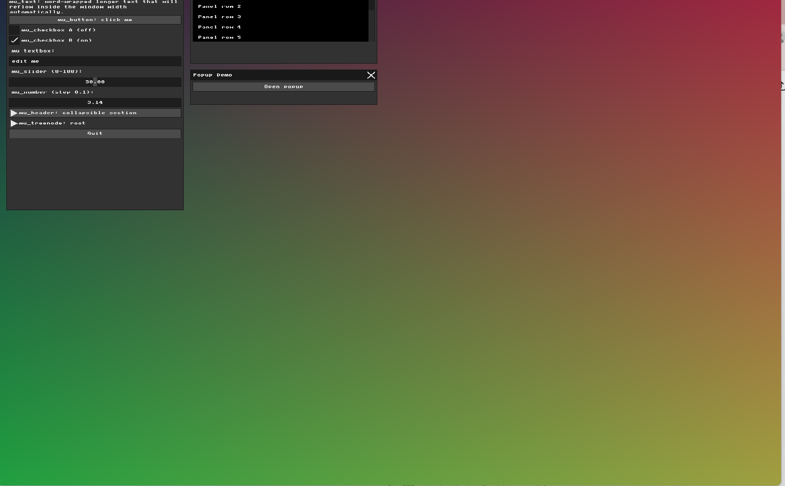
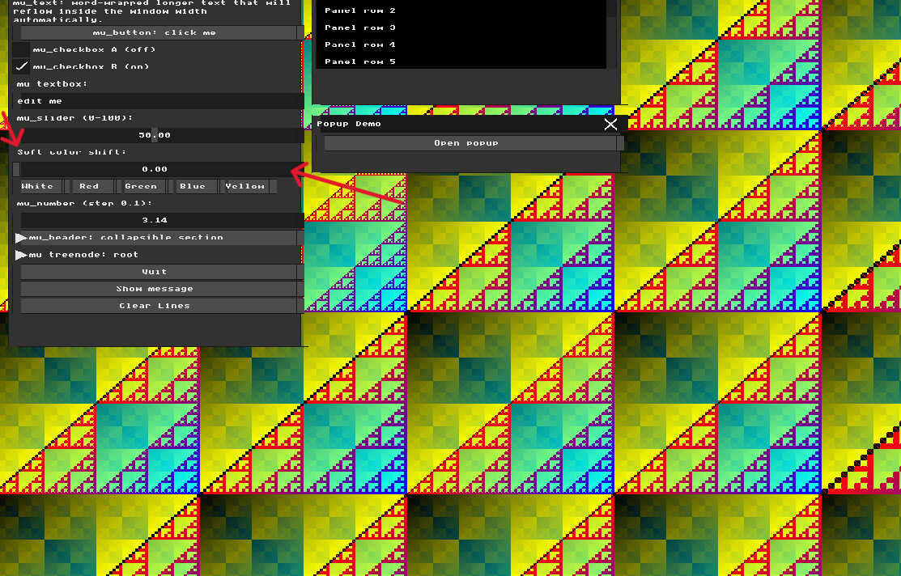
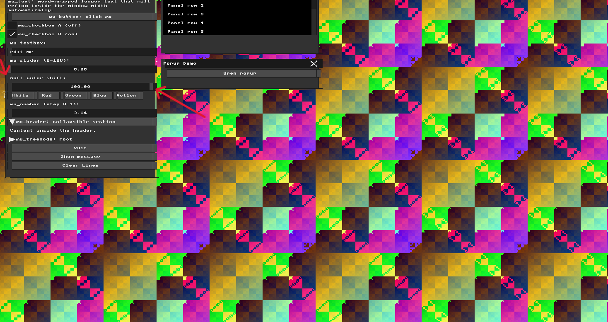
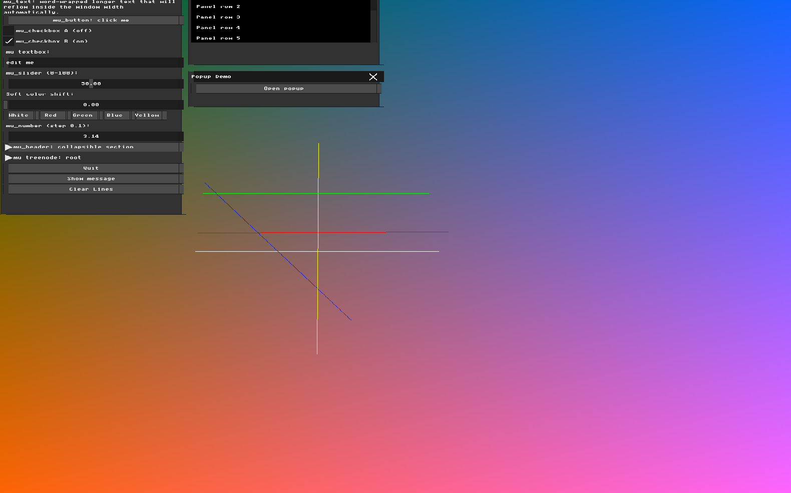

# Homework 1 — NanoRender

**Name:** Farida Dabit
**ID:** 212693345
**Course:** Computer Graphics

In this assignment I explored the NanoRender framework and implemented several modifications to the framebuffer, user interface, rendering behavior, and application state. The goal was to gain familiarity with low-level rendering concepts, immediate-mode GUI systems, and interactive graphics programming.

---

## Part 1 — Manipulating the Framebuffer

The goal of this task was to modify the framebuffer rendering loop and generate a custom two-dimensional pattern using both pixel coordinates, `x` and `y`.

Inside the scene rendering loop in `main.cpp`, I calculated the RGB channels using bitwise operations on the pixel coordinates:

```cpp
uint8_t r = (x ^ y) % 255;
uint8_t g = (x | y) % 255;
uint8_t b = (x & y) % 255;
```
The red channel uses bitwise XOR, the green channel uses bitwise OR, and the blue channel uses bitwise AND. Since each channel depends on both `x` and `y`, the resulting framebuffer contains a two-dimensional pattern rather than a solid color or a one-dimensional horizontal or vertical gradient.

The modulo operation keeps the calculated channel values within the valid RGB range.

### Result

The generated framebuffer produced a colorful repeating two-dimensional pattern across the screen, demonstrating direct manipulation of the framebuffer using pixel coordinates.



---

## Part 2 — Immediate Mode UI Declaration

The goal of this task was to add a new interactive widget to the MicroUI interface and practice working with the Immediate Mode programming model.

Inside the Widgets window in `main.cpp`, I added a new button called **"Show message"** and an external state variable named `show_message`.

When the button is pressed, the value of `show_message` is toggled and the program prints a message to the console. When `show_message` is active, the UI displays the label **"Hello from my widget!"**.

Because MicroUI uses an Immediate Mode architecture, the widget itself does not permanently store this state. Instead, the interface is recreated every frame and uses the current value of `show_message` to determine whether the label should be displayed.

### Result

The new button successfully changes application state and controls whether the additional label is shown in the MicroUI window. This demonstrates how an Immediate Mode interface can use external application variables to preserve state between frames.



---

## Part 3 — The Real-Time Graphics Loop and Input Handling

The goal of this task was to intercept keyboard input in the character input callback and use it to modify the rendered framebuffer in real time.

In `main.cpp`, I added an application state variable named `background_mode`. Inside the callback registered with `mfb_set_char_input_callback`, pressing either `C` or `c` advances the mode using:

```cpp
background_mode = (background_mode + 1) % 3;
```

This cycles between three different background rendering modes. The rendering loop checks the current value of `background_mode` and calculates the RGB channels differently for each mode, causing the framebuffer appearance to change immediately.

The `C` key event is intentionally consumed. After changing `background_mode`, the callback returns without forwarding that character to the UI input system. Other character input is still passed to `ui_bridge_char_input`, allowing normal MicroUI text input to continue working.

### Result

Pressing `C` cycles through three visually distinct framebuffer patterns in real time. This demonstrates how input callbacks can modify persistent application state while the continuously running rendering loop uses that state to update the displayed image.

**Background Mode 0**



**Background Mode 1**



**Background Mode 2**



---

## Part 4 — UI Architecture & The Renderer Bridge

The goal of this task was to explore the separation between the UI layout and interaction logic handled by MicroUI and the final pixel rendering performed by `UIRenderer`.

In `ui_renderer.cpp`, I modified `draw_rect()` so that rectangles that resemble buttons are drawn with a horizontal offset. The renderer identifies these rectangles based on their dimensions and shifts their rendered pixels 10 pixels to the right:

```cpp
if (looks_like_button) {
    shifted_x = x + 10;
}
```

This modification affects only the pixels written to the framebuffer. It does not change the rectangle coordinates stored by MicroUI or the coordinates used for mouse hit testing. The text is rendered separately by `draw_text()`, so it remains at its original position.

### Result

After the modification, the button backgrounds appear shifted 10 pixels to the right while their text and interactive regions remain at the original coordinates.

Because only the visual rendering was shifted, the visible button background and the original MicroUI hitbox no longer align perfectly. Most of the two regions still overlap, but the rightmost 10 pixels of the shifted background lie outside the original clickable area. To trigger the button reliably, the mouse cursor must remain within the button's original MicroUI coordinates.

This demonstrates that MicroUI's abstract UI state and input handling are independent from the renderer that converts its drawing commands into framebuffer pixels.



---

## Part 5 — Binding UI to Application State

The goal of this task was to create a custom application state variable, bind it to a MicroUI widget, and use that state to dynamically modify the rendered framebuffer.

In `main.cpp`, I added a floating-point state variable named `color_shift` and connected it to a new slider in the Widgets window:

```cpp
mu_label(ctx, "Soft color shift:");
mu_slider(ctx, &color_shift, 0, 100);
```

The slider receives a pointer to `color_shift`, allowing MicroUI to directly update the application state when the user moves the slider.

I then used the value of `color_shift` in the RGB calculations for background mode 0:

```cpp
r = ((x ^ y) + (int)color_shift) % 255;
g = ((x | y) + (int)(color_shift * 0.5f)) % 255;
b = ((x & y) + (int)(color_shift * 0.25f)) % 255;
```

Each color channel responds to the same slider value at a different rate. This preserves the underlying coordinate-based pattern while changing its color distribution interactively.

### Result

Moving the **Soft color shift** slider changes the colors of the framebuffer pattern in real time. This demonstrates the complete connection between an Immediate Mode widget, persistent application state, and the rendering loop.





---

## Part 6 — Interactive Line Drawing App

The goal of this task was to implement Bresenham's Line Algorithm and combine it with mouse input and the existing MicroUI interface to create an interactive line drawing application.

I first implemented a `put_pixel()` function that writes a color value to the framebuffer while checking that the pixel coordinates are inside the screen boundaries. I then implemented `draw_line()` using Bresenham's algorithm.

The line algorithm uses integer error calculations and directional step values to support lines with different slopes and drawing directions without requiring separate implementations for each octant.

### AI-Assisted UX Planning

Before implementing the mouse interaction, I used an AI assistant to compare two possible approaches for drawing a line:

- **Click once, then click again:** the first click defines the start point and the second click defines the endpoint. This is simple, but requires two separate actions and makes the current drawing state less visually obvious.
- **Click, drag, and release:** pressing the mouse button defines the start point, dragging updates the endpoint and provides a live preview, and releasing the button finalizes the line.

I selected the **click-drag-release** approach because it provides immediate visual feedback while the line is being positioned and allows the complete interaction to be performed as one continuous gesture.

The application stores whether a line is currently being drawn using `is_drawing`. When the left mouse button is first pressed, the start position is stored. While the button remains pressed, the current mouse position is updated and a temporary preview line is drawn. When the button is released, the completed line is added to the persistent line collection.

To support multiple permanent lines, I created a `Line` structure containing the two endpoints and the selected color. Previously completed lines are stored in an array and redrawn every frame.

### User Interface Extensions

I also added several controls to make the drawing tool more useful:

- **White, Red, Green, Blue, and Yellow** buttons for selecting the current line color.
- A **Clear Lines** button that resets the stored line count and clears all previously drawn lines.
- A real-time preview of the current line while the mouse is being dragged.

### Result

The final application allows the user to draw multiple persistent colored lines directly on the framebuffer. The interaction combines Bresenham line rasterization, mouse state tracking, persistent application state, framebuffer rendering, and Immediate Mode UI controls.


