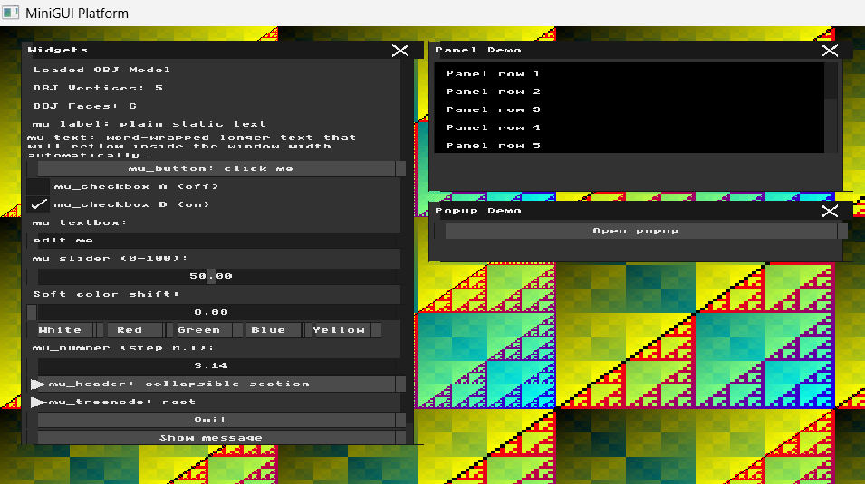
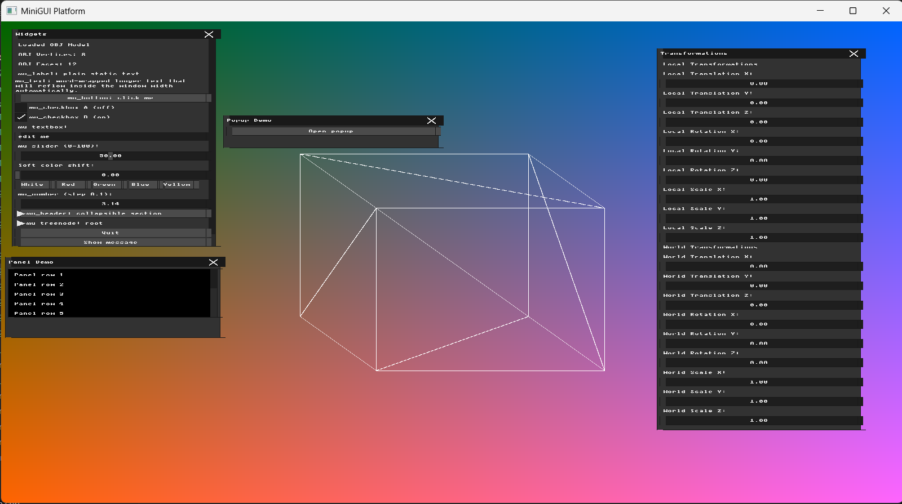
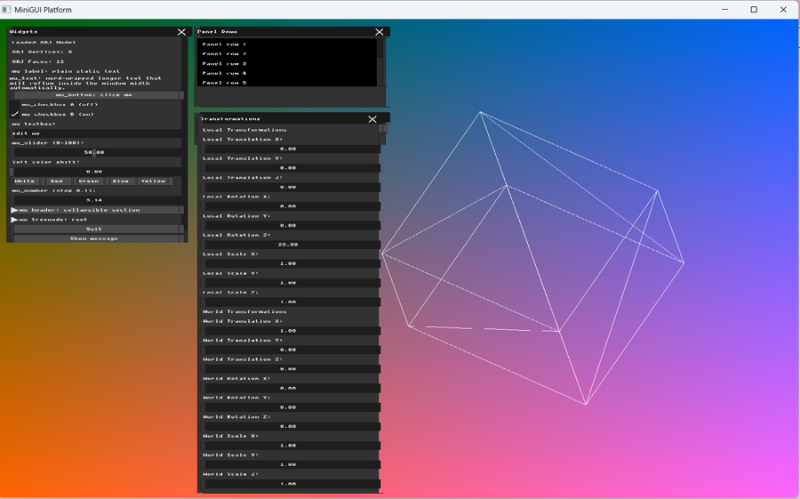
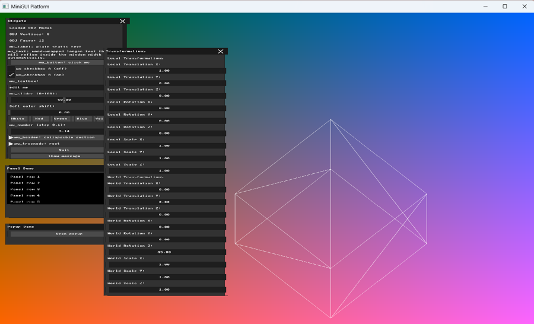
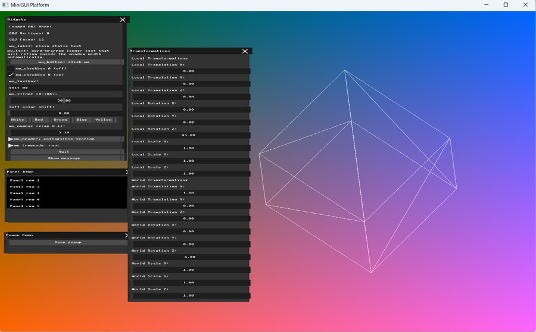
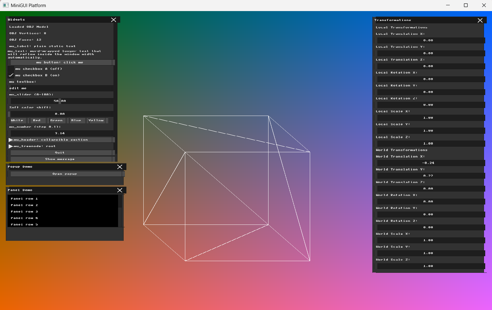

# Homework 2

**Name:** Farida Dabit
**ID:** 212693345
**Course:** Computer Graphics

---

## Part 0 — Introduction to GLM

GLM was added to the project through CMake and linked to the application.

To verify the integration, two `glm::vec3` vectors were created and added together. The project configured and compiled successfully, and the example produced the expected result:

```text
GLM example: (5.0, 7.0, 9.0)
```
---

## Part 1 — Loading and Inspecting 3D Data

For this part, I implemented a simple `.obj` loader for triangular meshes using plain vertex indices. The loader stores the mesh vertices and triangular faces in memory.

The loader reads:

- Vertices from lines beginning with `v`.
- Faces from lines beginning with `f`.

The vertices are stored as 3D points using `glm::vec3`, and each triangular face stores the indices of three vertices using `glm::ivec3`.

To test the loader, I created a small `.obj` file containing a pyramid with 5 vertices and 6 triangular faces.

After loading the file, I displayed the number of loaded vertices and faces in the GUI:

- OBJ Vertices: 5
- OBJ Faces: 6

For this part, the loader was tested using the small pyramid model described above. In later parts of the assignment, I switched to a separate `wireframe_model.obj` containing 8 vertices and 12 triangular faces so that the 3D wireframe and transformation effects would be easier to observe.



**Figure 1:** Loaded OBJ model information showing 5 vertices and 6 faces in the GUI.

---

## Part 2 — Normalization and the Viewport Transform

OBJ models may use arbitrary coordinate ranges, so I calculated a temporary normalization transformation that scales and centers the loaded model inside the framebuffer.

First, I calculated the mesh bounding box by finding the minimum and maximum x, y, and z coordinates of all vertices.

For `wireframe_model.obj`, the bounding box is:

- Minimum corner: `(-1.0, -1.0, -0.5)`
- Maximum corner: `(1.0, 1.0, 0.5)`

The model size and center are calculated using:

```text
model_size = max_corner - min_corner
model_center = (min_corner + max_corner) / 2
```

For this model:

- Model size: `(2.0, 2.0, 1.0)`
- Model center: `(0.0, 0.0, 0.0)`

To leave enough room for the GUI and keep the model comfortably inside the window, I use 45% of the framebuffer width and height:

```text
usable_width  = WIDTH * 0.45
usable_height = HEIGHT * 0.45
```

For the 1600 × 1200 framebuffer:

```text
usable_width  = 720
usable_height = 540
```

The scale required for each screen dimension is:

```text
scale_x = usable_width / model_size.x
scale_y = usable_height / model_size.y
```

which gives:

```text
scale_x = 360
scale_y = 270
```

A single uniform scale is selected:

```text
uniform_scale = min(scale_x, scale_y)
```

Therefore:

```text
uniform_scale = 270
```

Using the same scale factor preserves the original proportions of the model.

The framebuffer center is:

```text
window_center = (800, 600, 0)
```

The translation is calculated using:

```text
translation = window_center - model_center * uniform_scale
```

Since the model center is `(0, 0, 0)`, the resulting translation is:

```text
translation = (800, 600, 0)
```

A vertex can then be mapped to framebuffer coordinates using:

```text
transformed = vertex * uniform_scale + translation
```

This normalization allows the model to fit clearly inside the framebuffer while preserving its proportions.

---

## Part 3 — Orthographic Projection and Wireframe Rendering

In this part, I implemented orthographic projection and wireframe rendering for the loaded 3D mesh.

The normalization values calculated in Part 2 (`uniform_scale` and `translation`) are reused during rendering. For each triangular face, the three corresponding mesh vertices are retrieved and mapped into framebuffer coordinates.

The orthographic projection is performed by using only the x and y coordinates of each vertex and ignoring the z coordinate:

```text
(x, y, z) → (x, y)
```

Each triangle is then rendered by drawing its three edges using the `draw_line` function implemented in Homework 1:

- v0 → v1
- v1 → v2
- v2 → v0

A separate OBJ test model containing 8 vertices and 12 triangular faces was used so that the wireframe structure could be clearly seen after projection. The model was scaled and centered inside the viewport using the normalization calculated in Part 2.

The result is a wireframe representation of the 3D mesh. Since hidden surface removal and a Z-buffer are not implemented in Homework 2, edges from both the front and back triangles may be visible.



**Figure 2:** Orthographic wireframe rendering of the test mesh.


---
## Part 4 — Transformation Matrices & Immediate Mode GUI

In this part, I added transformation parameters and GUI controls for manipulating the 3D model.

Using GLM, I created 4×4 transformation matrices for translation, rotation, and scaling. Separate transformation parameters were added for both **Local** and **World** transformations.

The GUI contains X, Y, and Z controls for:

- Local Translation
- Local Rotation
- Local Scale
- World Translation
- World Rotation
- World Scale

Rotation values entered in the GUI are stored in degrees and converted to radians using `glm::radians()` when constructing the rotation matrices.

Local rotation and scaling are constructed around the model center, while separate matrices are maintained for the World transformations.

The local transformation matrix is constructed as:

```text
Local = R_local_about_center * T_local * S_local_about_center
```

The World translation, rotation, and scale matrices are then combined with the local transformation when constructing the final transformation matrix. The actual application of this matrix to the mesh vertices is demonstrated in Part 5.



**Figure 3:** Local and World transformation controls in the Immediate Mode GUI.

---

## Part 5 — Applying Transformations

In this part, the transformation matrices computed from the GUI values were applied to the mesh vertices before the orthographic projection and wireframe rendering.

Since matrix multiplication is not commutative, transformations in different frames of reference can produce different visual results.

The first configuration combines a translation in the local model frame with a rotation in the world frame. The local translation changes the model position before the world rotation affects the resulting position.

**Configuration 1:**

- Local Translation X = 1
- World Rotation Z = 45°
- All other translations and rotations = 0
- All scale values = 1



**Figure 4:** Configuration 1 — Local Translation X = 1 and World Rotation Z = 45°.

The second configuration combines a rotation in the local model frame with a translation in the world frame. The local rotation is performed around the model center, so the object rotates around itself while the world translation controls its position in the scene.

**Configuration 2:**

- Local Rotation Z = 45°
- World Translation X = 1
- All other translations and rotations = 0
- All scale values = 1



**Figure 5:** Configuration 2 — Local Rotation Z = 45° and World Translation X = 1.

The two configurations demonstrate that Local and World transformations affect the final position and orientation of the model differently, consistent with the fact that matrix multiplication is not commutative.

---

## Part 6 — Interactive Input Modifiers

For direct interaction, I mapped the keyboard arrow keys to World Translation.

The right and left arrow keys modify the X component of `world_translation`, while the up and down arrow keys modify the Y component. The keyboard state is read using `mfb_get_key_buffer()`, and the arrow keys directly update the corresponding `world_translation` components.

Because the arrow keys modify the same `world_translation` variables used by the transformation matrix and the GUI controls, the model moves immediately on screen and the corresponding World Translation values in the GUI are updated at the same time.

Keyboard mapping:

- Right Arrow → increase `world_translation.x`
- Left Arrow → decrease `world_translation.x`
- Up Arrow → decrease `world_translation.y`, moving the model upward on screen
- Down Arrow → increase `world_translation.y`, moving the model downward on screen

The Y direction is reversed relative to the usual Cartesian convention because framebuffer Y coordinates increase downward on the screen.



**Figure 6:** Interactive World Translation using the keyboard arrow keys. The updated X and Y translation values are shown in the Transformations GUI.
