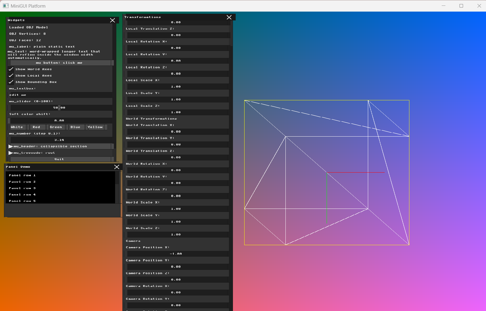
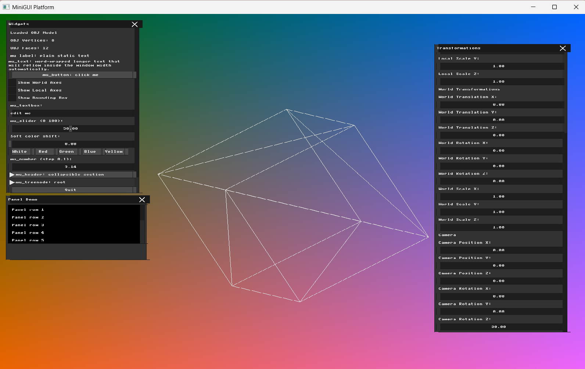
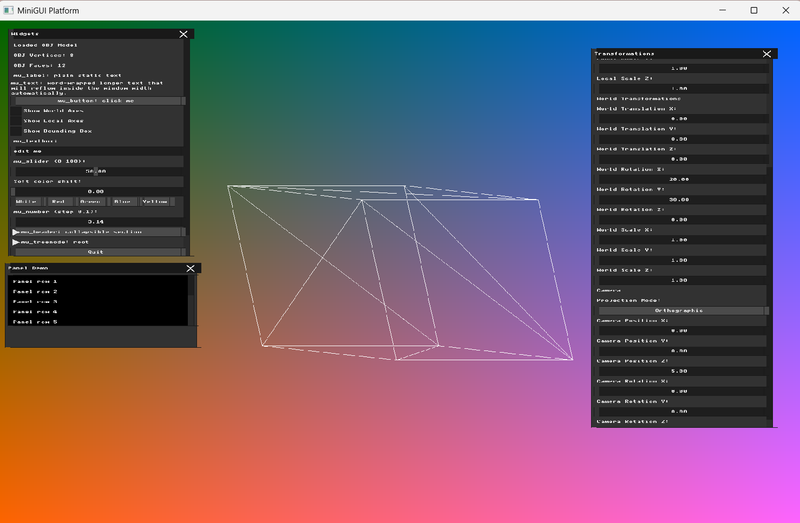
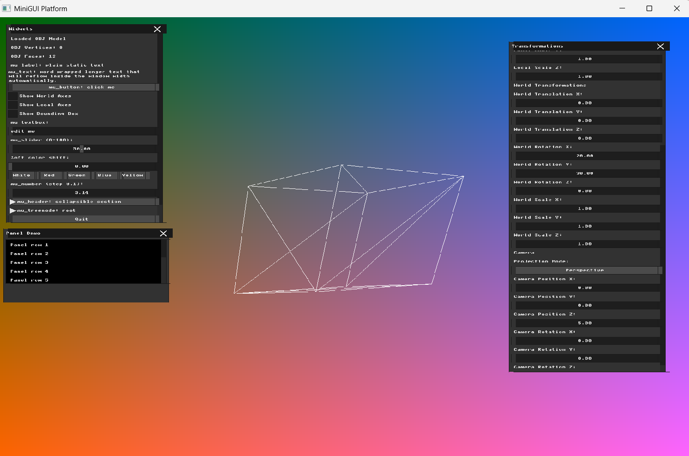
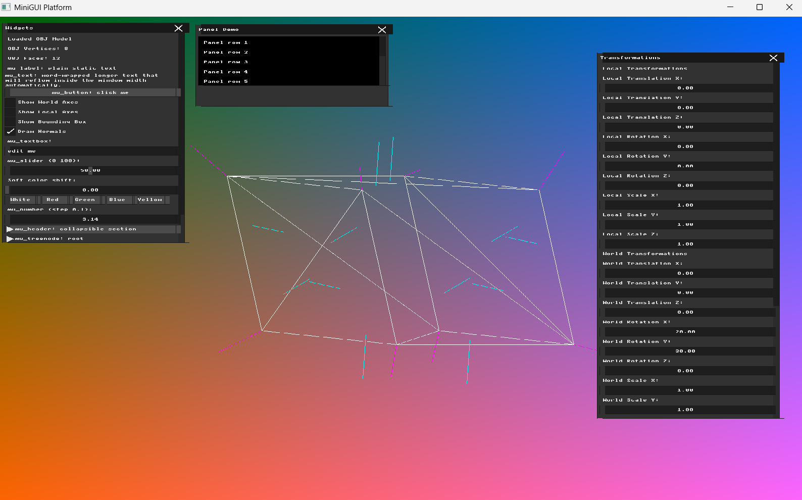

# Homework 3 — Virtual Cameras and Projections

**Name:** Farida Dabit
**ID:** 212693345
**Course:** Computer Graphics

---

## Part 1 — Coordinate Frames and Bounding Boxes

### Implementation

For this part, I added visual debugging tools for the model's coordinate frames and bounding box.

The existing bounding-box calculation was reused to obtain the minimum and maximum coordinates of the loaded mesh. These values are kept available during rendering so they can also be used for the debug visualization.

I added three UI checkboxes:

- `Show World Axes`
- `Show Local Axes`
- `Show Bounding Box`

The coordinate axes use the standard colors: red for X, green for Y, and blue for Z.

The World axes are drawn from the world origin `(0, 0, 0)` without applying the model transformation. Therefore, they remain fixed when the model is transformed.

The Local axes originate at the model center. Their endpoints are transformed using the same `final_transform_matrix` as the mesh, so they move and rotate together with the model.

For the bounding box, I constructed its eight corners from `min_corner` and `max_corner`. Each corner is transformed with the same model transformation, and the twelve edges of the box are drawn using `draw_line`.

### Verification

First, I enabled only the World axes and translated the model along the world X axis. The model moved while the World axes remained at the original world origin.

Next, I enabled only the Local axes. I rotated the model around the local X and Y axes and translated it in the world X direction. The Local axes moved and rotated together with the model. With the model rotated in 3D, the red X, green Y, and blue Z directions can all be seen.

Finally, I enabled only the bounding-box visualization and rotated the model around the local X and Y axes. The yellow wireframe bounding box remained aligned with the transformed model.

### Result

The renderer can now independently display the fixed World coordinate frame, the model's Local coordinate frame, and its 3D wireframe bounding box. These debug visualizations make it easier to distinguish between transformations in world space and transformations relative to the model.

---

## Part 2 — The Virtual Camera (View Matrix)

### Implementation

For this part, I added a simple virtual camera with a position and rotation in world space.

The camera is represented by a `Camera` struct containing two `glm::vec3` values:

- `position`
- `rotation`

I also added UI controls for changing the camera position and rotation along the X, Y, and Z axes.

The camera transform is constructed from its translation and rotation matrices. The View matrix is then calculated as the inverse of the camera transform:

`View = inverse(Camera Transform)`

This inverse is necessary because moving the camera is represented by applying the opposite transformation to the world.

The existing model transformations are applied first. The resulting world-space points are then transformed by the View matrix before being converted to screen coordinates. Therefore, the rendering flow for this part is:

`Model → View → Screen`

This corresponds to the required graphics pipeline order `P * V * M * v`. Perspective projection is not added yet in this part, so the existing screen mapping is still used after the View transformation.

The same View transformation is also applied consistently to the debugging geometry. The transformed bounding box and Local axes first follow the model transformation and then pass through the camera View matrix. The World axes do not receive the model transformation, but they do pass through the View matrix because they are part of the world viewed by the camera.

### Verification

To verify camera translation, I set the camera position to `(-1, 0, 0)` while keeping the camera rotation at zero. Moving the camera to the left caused the model to appear shifted to the right on the screen, which confirms that the inverse camera transformation is being applied correctly.

I also tested camera rotation by resetting the camera position to `(0, 0, 0)` and setting the Z rotation to `30` degrees. The rendered scene rotated in the opposite direction of the camera rotation, as expected from the inverse View transformation.

### Result

The renderer now supports a virtual camera with controllable world-space position and rotation. The View matrix is constructed from the inverse camera transformation and is applied consistently to the model and the relevant debugging geometry. Camera translation and rotation were both verified visually.

---

## Part 3 - Perspective Projection

### Implementation

For this part, I added a perspective projection mode while preserving the existing orthographic view.

The perspective projection is constructed using `glm::perspective`. The projection parameters are:

- Field of View: `60` degrees
- Aspect ratio: `WIDTH / HEIGHT`
- Near clipping plane: `0.1`
- Far clipping plane: `100.0`

After the model transformation and View transformation, points in Perspective mode are multiplied by the Perspective Projection matrix. This produces homogeneous clip-space coordinates.

The Perspective Divide is then performed explicitly by dividing the projected X, Y, and Z coordinates by the homogeneous `w` component:

`NDC = clip.xyz / clip.w`

The resulting Normalized Device Coordinates are converted from the `[-1, 1]` range to framebuffer pixel coordinates.

The resulting Perspective rendering flow is therefore:

`Model -> View -> Projection -> Perspective Divide -> Screen`

I also added a `Projection Mode` button to the Transformations UI. The button toggles between `Orthographic` and `Perspective`. In Orthographic mode, the renderer continues to use the previous screen mapping, while Perspective mode applies the new projection matrix and Perspective Divide.

Because the model, transformed bounding box, Local axes, and World axes all use the common screen-conversion function, the selected projection is applied consistently to the rendered scene and debugging geometry.

### Verification

To compare the two projection modes, I rotated the model by `20` degrees around the world X axis and `30` degrees around the world Y axis. The camera was positioned at `(0, 0, 5)` with zero camera rotation.

First, I rendered the model using Orthographic projection. Increasing the camera's Z distance does not make the object smaller in this mode, and the model does not show perspective foreshortening.

I then kept the same model transformation and camera position and switched only the Projection Mode to Perspective. The model became smaller with distance, and vertices at different depths were projected differently, producing a clear perspective effect.

This comparison verifies that the Perspective Projection matrix and Perspective Divide are being applied correctly.

### Result

The renderer now supports both Orthographic and Perspective projection modes. Perspective mode uses a 60-degree FOV, a window-based aspect ratio, Near and Far clipping-plane values, and an explicit Perspective Divide before converting the projected coordinates to screen pixels. The difference between Orthographic and Perspective projection was verified visually using the same camera and model configuration.
---

## Part 4 - Calculating Normals

### Implementation

For this part, I added support for calculating both Face Normals and Vertex Normals for the loaded mesh.

Two new arrays were added to the `Mesh` structure:

- `face_normals`
- `vertex_normals`

#### Face Normals

A Face Normal is calculated for each triangle using two of its edges.

For a triangle with vertices `v0`, `v1`, and `v2`, two edge vectors are constructed:

`edge1 = v1 - v0`

`edge2 = v2 - v0`

The normal direction is then calculated using the cross product. For the winding order used by the current OBJ model, the outward-facing direction is obtained using:

`normal = cross(edge2, edge1)`

The resulting vector is normalized so that every Face Normal has unit length.

The cross-product order is important because reversing the order reverses the direction of the resulting normal. During verification, the original cross-product order produced normals pointing inward. Reversing the order made the normals point outward consistently with the winding of the loaded model.

#### Vertex Normals

A Vertex Normal is calculated by accumulating the Face Normals of all triangles that share the vertex.

Each Vertex Normal is initially set to `(0, 0, 0)`. For every triangle, its Face Normal is added to the three vertices belonging to that triangle. After all adjacent Face Normals have been accumulated, each resulting vector is normalized.

This produces a direction representing the average orientation of the faces surrounding each vertex and can later be used for smooth shading.

#### Normal Visualization

I added a `Draw Normals` checkbox to the debugging UI.

When enabled, the renderer draws:

- Face Normals in cyan.
- Vertex Normals in magenta.

Each Face Normal is drawn as a short line starting at the center of its triangle.

Each Vertex Normal is drawn as a short line starting directly from its vertex.

The normal length is scaled relative to the model bounding-box size so that the debugging lines remain clearly visible.

Both endpoints of every normal line are transformed using the same `final_transform_matrix` as the model and are then passed through the existing screen-conversion pipeline. Therefore, the normals remain attached to the model and transform correctly when the model is moved, scaled, or rotated.

### Verification

The loaded test model contains `12` triangular faces and `8` vertices. The calculation produced exactly:

- `12` Face Normals
- `8` Vertex Normals

During numerical verification, all calculated normals had a length of approximately `1.00`, confirming that they were normalized correctly.

I also verified the normal directions visually using the `Draw Normals` debug option. The Face Normals point outward from the centers of the triangles, while the Vertex Normals point outward from the vertices according to the surrounding face directions.

To verify that the normals transform correctly with the model, I set the World Rotation to:

- X = `20` degrees
- Y = `30` degrees
- Z = `0` degrees

Both the cyan Face Normals and magenta Vertex Normals rotated together with the wireframe model while remaining attached to their corresponding faces and vertices.

### Result

The renderer can now calculate and store both Face Normals and Vertex Normals for the loaded mesh. Face Normals are computed using the cross product of triangle edges, while Vertex Normals are obtained from the normalized sum of adjacent Face Normals.

The `Draw Normals` debugging option provides a visual verification of both types of normals. The normals point outward from the model and transform correctly together with the model, providing the geometric information required for later lighting and shading calculations.
