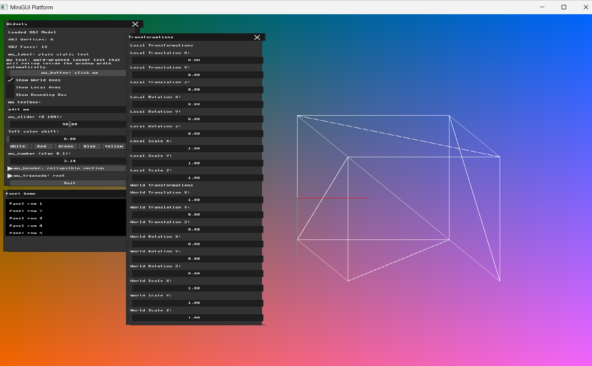
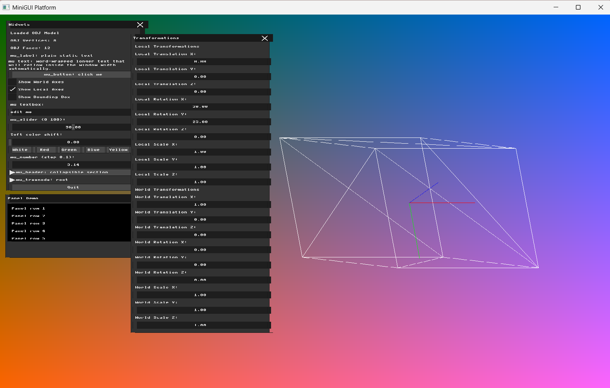
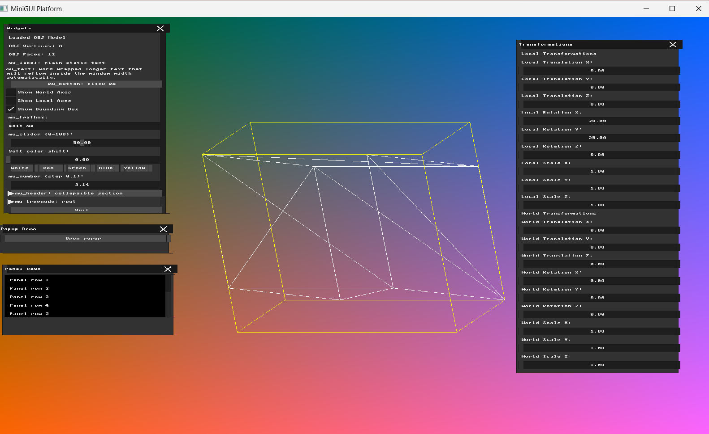

# Homework 3 — Virtual Cameras and Projections

**Name:** Farida Dabit
**ID:** 212693345
**Course:** Computer Graphics

---

## Part 1 — Coordinate Frames and Bounding Boxes

### Implementation

For this part, I added visual debugging tools for the model's coordinate frames and bounding box.

The existing bounding-box calculation was reused to obtain the minimum and maximum coordinates of the loaded mesh. These values are kept available during rendering so they can also be used for the debug visualization.

I added three UI checkboxes:

- `Show World Axes`
- `Show Local Axes`
- `Show Bounding Box`

The coordinate axes use the standard colors: red for X, green for Y, and blue for Z.

The World axes are drawn from the world origin `(0, 0, 0)` without applying the model transformation. Therefore, they remain fixed when the model is transformed.

The Local axes originate at the model center. Their endpoints are transformed using the same `final_transform_matrix` as the mesh, so they move and rotate together with the model.

For the bounding box, I constructed its eight corners from `min_corner` and `max_corner`. Each corner is transformed with the same model transformation, and the twelve edges of the box are drawn using `draw_line`.

### Verification

First, I enabled only the World axes and translated the model along the world X axis. The model moved while the World axes remained at the original world origin.

Next, I enabled only the Local axes. I rotated the model around the local X and Y axes and translated it in the world X direction. The Local axes moved and rotated together with the model. With the model rotated in 3D, the red X, green Y, and blue Z directions can all be seen.

Finally, I enabled only the bounding-box visualization and rotated the model around the local X and Y axes. The yellow wireframe bounding box remained aligned with the transformed model.

### Result

The renderer can now independently display the fixed World coordinate frame, the model's Local coordinate frame, and its 3D wireframe bounding box. These debug visualizations make it easier to distinguish between transformations in world space and transformations relative to the model.