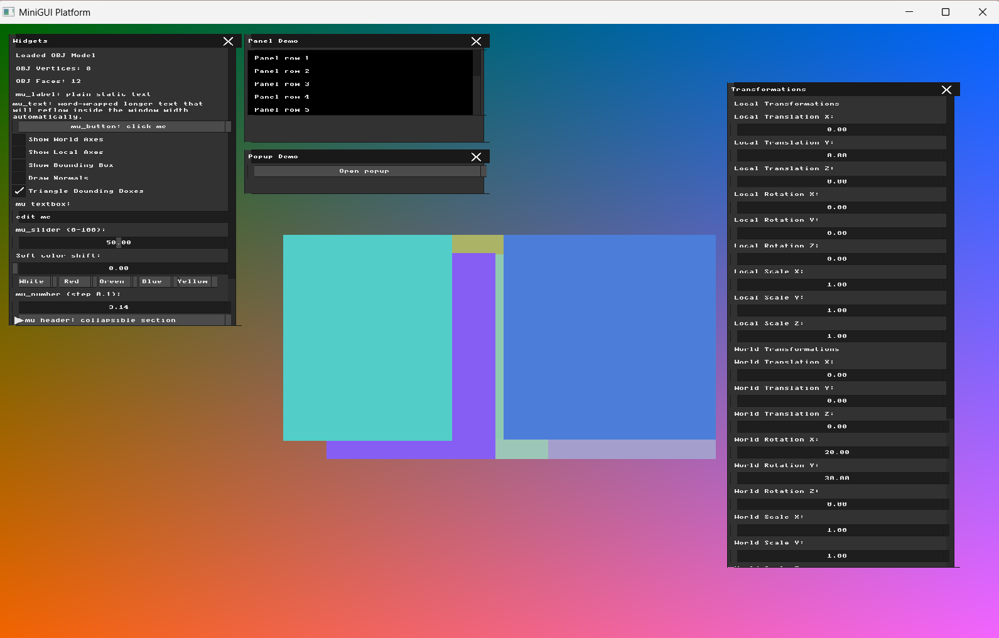
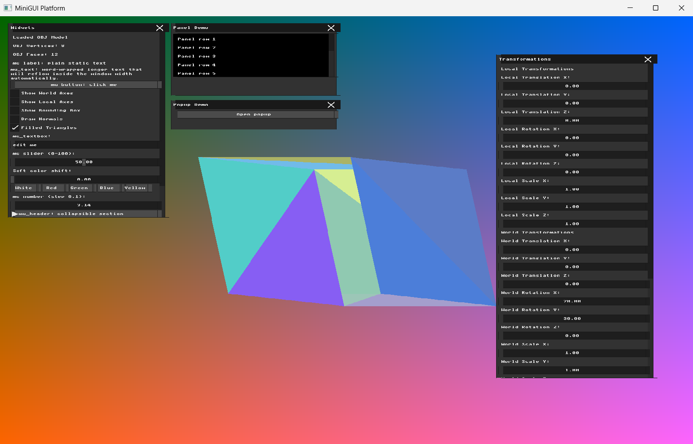
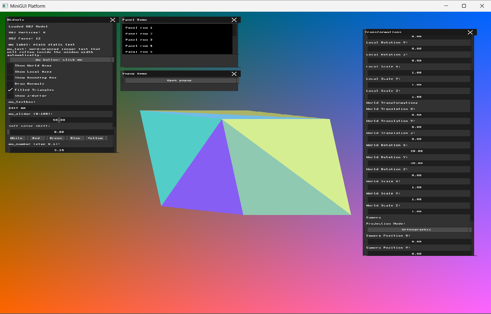
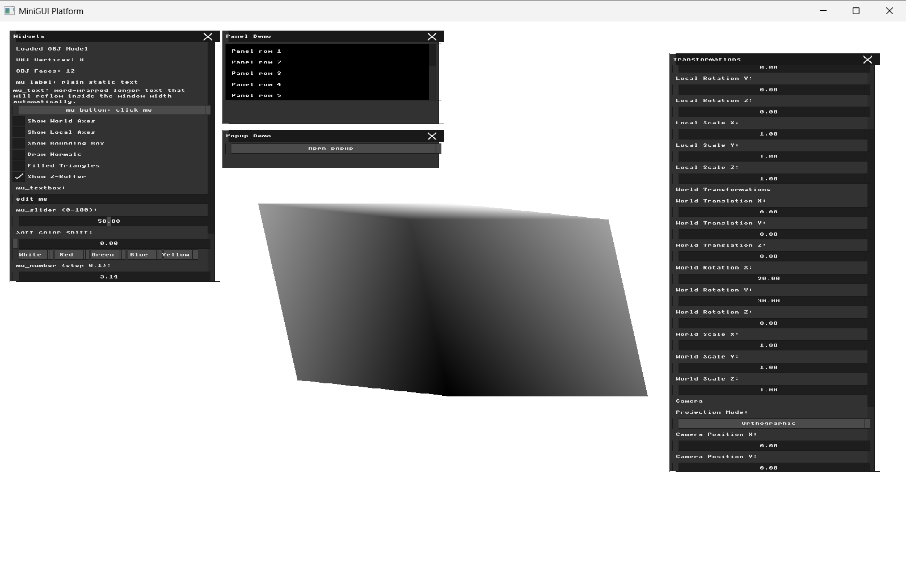

# Homework 4 - Triangle Rasterization and Depth Buffering

**Name:** Farida Dabit
**ID:** 212693345
**Course:** Computer Graphics

---

## Part 1 - Bounding Box Rasterization

### Implementation

For this part, I added a debugging rasterization mode that displays the screen-space bounding rectangle of every projected triangle.

After applying the existing model transformation and converting the three triangle vertices to screen coordinates, I calculate the minimum and maximum X and Y values of the projected vertices.

The minimum coordinates are rounded down using `floor`, while the maximum coordinates are rounded up using `ceil`, so the complete projected triangle is contained inside its rectangle.

The resulting rectangle is also clamped to the framebuffer boundaries:

- X coordinates are limited to `0 ... WIDTH - 1`
- Y coordinates are limited to `0 ... HEIGHT - 1`

Each mesh face is assigned a random solid color when the OBJ model is loaded. The colors are stored in `mesh.face_colors`, so the same face keeps the same color while the application is running instead of receiving a new random color every frame.

I added a new UI checkbox:

- `Triangle Bounding Boxes`

When this option is enabled, the renderer loops over every pixel in each triangle's screen-space bounding rectangle and writes the face color directly to `g_buffer`.

When the option is disabled, the original wireframe rendering remains available.

### Verification

I first verified that disabling `Triangle Bounding Boxes` preserves the existing wireframe rendering.

I then enabled the bounding-box visualization and rotated the model using:

- World Rotation X = `20`
- World Rotation Y = `30`
- World Rotation Z = `0`

The resulting image consists of overlapping solid-colored rectangles. Their positions and dimensions change according to the projected triangle vertices as the model rotates, while the rectangles themselves remain aligned with the screen axes, as expected for screen-space bounding rectangles.

### Result

The renderer can now calculate and visualize the 2D screen-space bounding rectangle of every triangle in the mesh. This provides the pixel region that will be used in the next part for triangle inclusion testing with Barycentric Coordinates.

---

## Part 2 - Triangle Rasterization with Barycentric Coordinates

### Implementation

In this part, I replaced the bounding-box-only fill from Part 1 with an actual triangle rasterization test based on Barycentric Coordinates.

I first added a helper function named `compute_barycentric(...)` that receives the three triangle vertices in screen space together with a pixel position `(x, y)` and computes the three barycentric weights:

- `alpha`
- `beta`
- `gamma`

The function uses the standard 2D barycentric-coordinate formula in screen space.
I also added a small safety check for degenerate triangles: if the denominator is close to zero, the function returns invalid values instead of dividing by zero.

The rasterization process still begins by computing the screen-space bounding rectangle of each projected triangle, exactly as in Part 1. Then, instead of coloring the entire rectangle, the renderer iterates over all pixels inside the rectangle and computes the barycentric coordinates of each pixel relative to the triangle.

A pixel is filled only if all three barycentric weights satisfy:

- `0 <= alpha <= 1`
- `0 <= beta <= 1`
- `0 <= gamma <= 1`

If these conditions hold, the pixel lies inside the triangle and is colored using the face color stored in `mesh.face_colors`.

To reflect the new behavior, I also renamed the UI checkbox from `Triangle Bounding Boxes` to `Filled Triangles`.

When the option is disabled, the original white wireframe rendering is still shown.

### Verification

I enabled `Filled Triangles` and rotated the model using:

- World Rotation X = `20`
- World Rotation Y = `30`
- World Rotation Z = `0`

The resulting image shows solid-colored triangles instead of the colored axis-aligned rectangles from Part 1. This confirms that pixels are no longer filled only according to the bounding rectangle, but according to actual triangle membership computed with barycentric coordinates.

I also verified that disabling `Filled Triangles` still restores the original wireframe rendering.

At this stage, some triangles may visually overlap in an incorrect front-to-back order. This is expected, because depth testing has not been implemented yet.

### Result

The renderer can now rasterize each triangle itself, rather than only its bounding rectangle. Barycentric coordinates are used to determine whether a screen pixel lies inside the triangle, which provides the correct foundation for the next part: interpolating depth values and implementing a Z-buffer.

---
## Part 3 - Z-Buffer Algorithm

### Implementation

In this part, I added a Z-buffer to solve the visibility problem that was still present after triangle rasterization in Part 2.

I added a floating-point depth buffer named `g_z_buffer` with the same number of entries as the color framebuffer. At the beginning of every frame, each depth value is initialized to a very large value (`1e30f`), representing a pixel for which no geometry has been drawn yet.

For every pixel that passes the barycentric triangle inclusion test, I calculate its interpolated Z value using the same barycentric weights:

`interpolated_z = alpha * v0.z + beta * v1.z + gamma * v2.z`

The existing projection pipeline stores different forms of Z depending on the active projection mode. In Perspective mode, `to_screen(...)` returns the Z coordinate after the perspective divide, so the triangle vertices contain NDC Z values. In Orthographic mode, the Z coordinate is derived from the view-space position and the existing screen transformation.

To use one consistent depth comparison in both modes, I convert the interpolated value to a depth value for which smaller values represent geometry closer to the camera. Perspective mode uses the interpolated Z directly, while Orthographic mode uses its negated value.

For each covered pixel, the calculated depth is compared with the value currently stored in `g_z_buffer`. The pixel is written to the color buffer only if its new depth is smaller than the stored depth. When this happens, both the Z-buffer and the color buffer are updated.

This prevents triangles processed later in the face loop from incorrectly overwriting geometry that is actually closer to the camera.

I also added a new UI checkbox:

- `Show Z-Buffer`

The Z-buffer mode can rasterize the model even when `Filled Triangles` is disabled. After rasterization, the visible depth values are normalized to a grayscale range. Pixels containing geometry are displayed according to their depth, while pixels that were not reached by any triangle are displayed as white background.

The depth visualization is applied before the UI is rendered, so the application controls remain visible on top of the grayscale depth map.

### Verification

I first verified the depth test using Orthographic projection with:

- World Rotation X = `20`
- World Rotation Y = `30`
- World Rotation Z = `0`
- World Translation = `(0, 0, 0)`
- World Scale = `(1, 1, 1)`

With `Filled Triangles` enabled and `Show Z-Buffer` disabled, the model is rendered as solid colored geometry. The incorrect front-to-back triangle overlaps visible in Part 2 no longer occur, confirming that the visible surface is selected using the per-pixel depth test rather than face drawing order.

I also verified the depth test in Perspective projection using the same model rotation and a camera position of `(0, 0, 5)`. The visibility result remained correct in Perspective mode.

Finally, I enabled `Show Z-Buffer` and disabled `Filled Triangles`. The model was displayed as a continuous grayscale depth map instead of using the random face colors. The grayscale values vary across the surfaces according to their interpolated per-pixel depth, confirming that the visualization is generated from the Z-buffer values.

The following images show the Color Buffer and Z-Buffer from the same Orthographic view:

| Color Buffer | Z-Buffer |
| --- | --- |
|  |  |

### Result

The renderer now performs per-pixel hidden-surface removal using a Z-buffer. Each rasterized pixel receives an interpolated depth value, and only the closest visible sample is allowed to update the color framebuffer.

The implementation works with both the existing Orthographic and Perspective projection modes. A dedicated Z-buffer visualization mode also makes it possible to inspect the stored depth information directly as a grayscale image.

---
