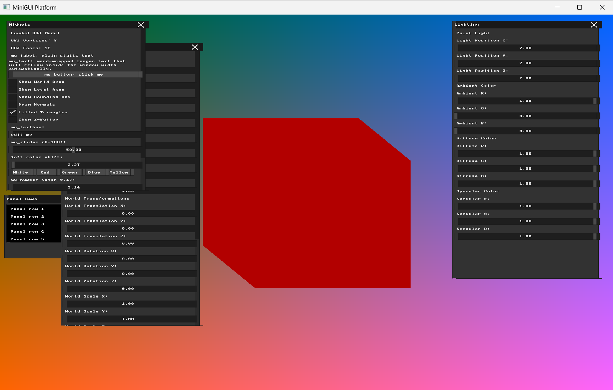
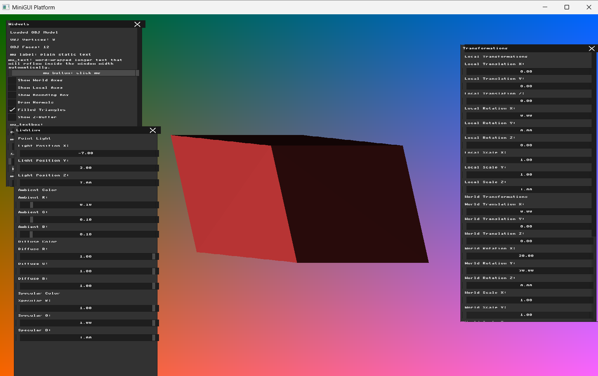
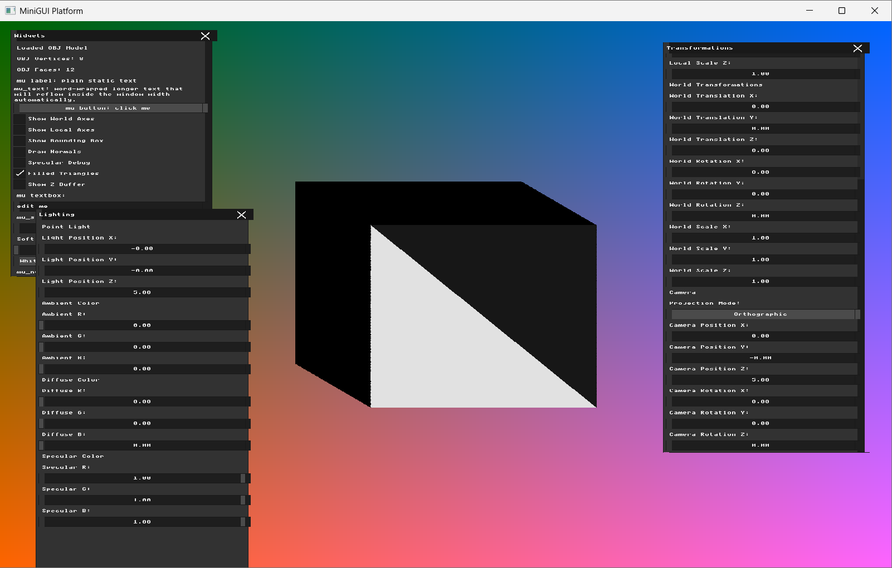
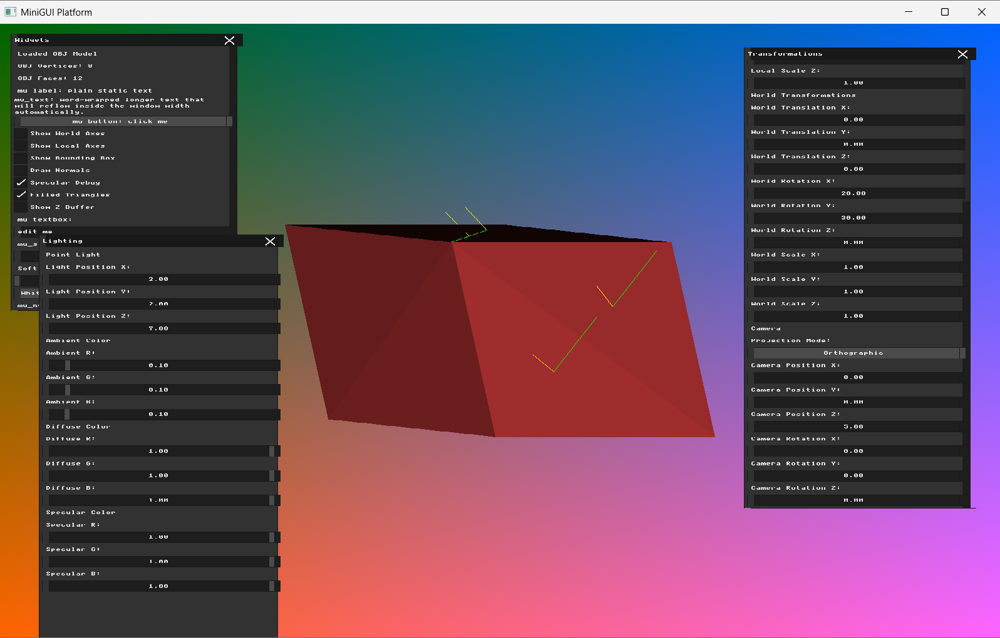

# Homework 5 - Lighting, Materials, and Shading

**Name:** Farida Dabit
**ID:** 212693345
**Course:** Computer Graphics

---

## Part 1 - Light Sources and Material Properties

### Implementation

For this part, I added the basic light and material representation required for the lighting pipeline.

I created a `PointLight` struct containing:

- A 3D light position
- Ambient RGB color
- Diffuse RGB color
- Specular RGB color

I also created a `Material` struct containing corresponding Ambient, Diffuse, and Specular RGB properties. The color properties are stored as `glm::vec3` values in the range `0 ... 1`, which allows the RGB components to be used directly in lighting calculations.

A point light and a material were then initialized as part of the application state.

I added a new `Lighting` UI window that allows the light properties to be modified while the application is running. The window contains controls for:

- Light Position X, Y, and Z
- Ambient R, G, and B
- Diffuse R, G, and B
- Specular R, G, and B

At this stage, only the Ambient component is used by the renderer.

The Ambient lighting color is calculated by component-wise multiplication of the light's Ambient color and the material's Ambient color:

`ambient_color = point_light.ambient * material.ambient`

The resulting RGB values are clamped to the range `0 ... 1` and converted to the framebuffer's `0 ... 255` RGB representation before the triangle pixels are written.

The existing triangle rasterization and Z-buffer logic from Homework 4 remain unchanged. Only the solid triangle color was replaced by the calculated Ambient lighting color.

### Verification

I enabled `Filled Triangles` and disabled `Show Z-Buffer`.

For the screenshot, I used the following light settings:

- Light Position X = `2.0`
- Light Position Y = `2.0`
- Light Position Z = `7.0`
- Ambient R = `1.0`
- Ambient G = `0.0`
- Ambient B = `0.0`

The material Ambient color was initialized to:

- Material Ambient = `(0.7, 0.2, 0.2)`

With only the red Ambient light component enabled, the complete model is rendered with a uniform red color. There are no brightness differences between the individual faces, which is expected because no directional lighting calculation is performed in this part.

I also changed the Ambient RGB controls individually and verified that the rendered color responds to those UI changes.

To confirm that only Ambient lighting is active, I changed the Light Position as well as the Diffuse and Specular controls. These changes did not affect the rendered model, as expected at this stage.

### Result

The renderer now contains explicit Point Light and Material properties and supports interactive control of the light through the UI.

Ambient lighting is calculated from the light and material Ambient colors and is used as the solid model color. The result is intentionally flat and independent of the light position, providing the foundation for the directional Diffuse lighting that will be implemented in Part 2.

---
## Part 2 - Flat Shading (Diffuse Lighting)

### Implementation

In this part, I extended the Ambient lighting implementation from Part 1 by adding Diffuse lighting using Lambert's Cosine Law.

The lighting calculation is performed once per triangle, producing a single uniform color for all pixels belonging to that triangle.

To ensure that the lighting calculations use a consistent coordinate system, I performed them in World Space.

For each triangle, I calculated its center using the three transformed vertices:

`triangle_center = (v0 + v1 + v2) / 3.0`

I then calculated the face normal using the edges of the transformed triangle.

The normal was computed using the same cross-product order as the existing face-normal implementation and normalized before being used in the lighting calculation.

I also added a check to avoid division by zero when the normal has a very small length.

Next, I calculated the direction from the triangle center toward the point light:

`light_direction = point_light.position - triangle_center_world`

The light direction was normalized, with an additional check to avoid division by zero.

The Diffuse factor is calculated using Lambert's Cosine Law:

`diffuse_factor = max(dot(face_normal_world, light_direction), 0.0)`

This ensures that the Diffuse contribution cannot be negative.

The Diffuse color is calculated using component-wise multiplication:

`diffuse_color = point_light.diffuse * material.diffuse * diffuse_factor`

Finally, I combined the Ambient and Diffuse components:

`final_color = ambient_color + diffuse_color`

The resulting RGB values are clamped to the range `0 ... 1` and converted to the framebuffer's `0 ... 255` RGB representation.

The final color is calculated once per triangle, before the rasterization loops, and is used for all pixels of that triangle.

The existing triangle rasterization and Z-buffer logic remain unchanged.

Specular lighting is not implemented in this part.

### Verification

I enabled `Filled Triangles` and disabled `Show Z-Buffer` and `Draw Normals`.

I used the following World Rotation settings:

- World Rotation X = `20.0`
- World Rotation Y = `30.0`
- World Rotation Z = `0.0`

The initial lighting settings were:

- Light Position = `(2.0, 2.0, 7.0)`
- Ambient RGB = `(0.1, 0.1, 0.1)`
- Diffuse RGB = `(1.0, 1.0, 1.0)`

The rendered model showed different brightness levels across its triangles, while each individual triangle maintained a uniform color.

To verify that the lighting responds to the light position, I changed Light Position X from `2.0` to `-7.0`, keeping the other settings unchanged.

The brightness distribution changed: the left side became brighter, while the right side became significantly darker.

I also tested the Ambient and Diffuse components separately.

First, I set Diffuse RGB to `(0.0, 0.0, 0.0)` while keeping Ambient RGB at `(0.1, 0.1, 0.1)`.

The model returned to a uniform dark color, confirming that the directional Diffuse contribution was disabled.

Next, I set Ambient RGB to `(0.0, 0.0, 0.0)` and Diffuse RGB to `(1.0, 1.0, 1.0)`.

The model displayed directional lighting without the Ambient contribution. The illuminated triangles remained visible, while the triangles receiving little or no Diffuse lighting appeared dark.

For the final screenshot, I used:

- Light Position = `(-7.0, 2.0, 7.0)`
- World Rotation = `(20.0, 30.0, 0.0)`
- Ambient RGB = `(0.1, 0.1, 0.1)`
- Diffuse RGB = `(1.0, 1.0, 1.0)`

### Result

Flat Shading with Ambient and Diffuse lighting was successfully implemented.

Each triangle receives a single color calculated from its face normal, center position, light direction, and material properties.

The rendered model now responds to changes in the point light position, producing a faceted appearance with different brightness levels across the triangles.

The existing rasterization and depth-buffer functionality were preserved.

---
## Part 3 - Specular Highlights

### Implementation

In this part, I extended the existing Ambient and Diffuse lighting model by adding a Specular lighting component.

The lighting calculation remains Flat Shading: the lighting values are calculated once per triangle and the resulting color is used for all pixels of that triangle.

I added a `shininess` property to the `Material` structure and initialized it to:

`shininess = 32.0`

To calculate the Specular component, I first computed the incoming light direction.

The existing `light_direction` vector points from the triangle center toward the point light, so the incoming direction is the opposite vector:

`incident_direction = -light_direction`

I implemented a separate function to calculate the reflection vector using the surface normal:

`R = I - 2 * dot(I, N) * N`

where `I` is the incoming light direction and `N` is the normalized face normal.

The View vector is calculated in World Space from the triangle center toward the camera:

`view_direction = camera.position - triangle_center_world`

The View vector is normalized before being used, with a check to avoid division by zero.

The Specular factor is calculated by comparing the reflected light direction with the View direction:

`specular_factor = pow(max(dot(reflection_direction, view_direction), 0.0), material.shininess)`

The Specular calculation is only applied when the triangle also receives positive Diffuse lighting.

The Specular color is calculated using the Specular properties of the point light and material:

`specular_color = point_light.specular * material.specular * specular_factor`

Finally, the three lighting components are combined:

`final_color = ambient_color + diffuse_color + specular_color`

The resulting RGB values are clamped to the range `0 ... 1` before conversion to the framebuffer RGB representation.

To verify the reflection calculation, I added a `Specular Debug` option to the UI.

When enabled, the renderer draws debug vectors from the centers of several faces:

- Yellow lines represent the Incoming Light Vector.
- Green lines represent the Reflection Vector.

The vectors are calculated in World Space and then projected to screen coordinates using the existing `to_screen` function before being drawn with `draw_line`.

### Verification

I first verified the Specular calculation independently from the Ambient and Diffuse components.

For the isolated Specular test, I used:

- World Rotation = `(0.0, 0.0, 0.0)`
- Camera Position = `(0.0, 0.0, 5.0)`
- Light Position = `(0.0, 0.0, 5.0)`
- Ambient RGB = `(0.0, 0.0, 0.0)`
- Diffuse RGB = `(0.0, 0.0, 0.0)`
- Specular RGB = `(1.0, 1.0, 1.0)`
- Material Shininess = `32.0`

With Ambient and Diffuse completely disabled, a front-facing triangle became strongly illuminated while the other triangles remained dark.

This confirmed that the visible illumination was produced by the Specular component rather than by Ambient or Diffuse lighting.

I also verified the reflection-vector calculation using the new `Specular Debug` visualization.

For the debug screenshot, I used:

- World Rotation = `(20.0, 30.0, 0.0)`
- Camera Position = `(0.0, 0.0, 5.0)`
- Light Position = `(2.0, 2.0, 7.0)`
- Ambient RGB = `(0.1, 0.1, 0.1)`
- Diffuse RGB = `(1.0, 1.0, 1.0)`
- Specular RGB = `(1.0, 1.0, 1.0)`
- `Filled Triangles` enabled
- `Specular Debug` enabled

The yellow incoming-light vectors and green reflection vectors are visible from the centers of several faces and change direction according to the orientation of each face.

### Result

Specular Highlights were successfully added to the existing Ambient and Diffuse lighting model.

The renderer now calculates the incoming light direction, reflection direction, View vector, Shininess contribution, and Specular color for each triangle.

The final triangle color is calculated from the sum of the Ambient, Diffuse, and Specular components while preserving the existing Flat Shading approach.

The debug visualization also provides a direct visual verification of the incoming and reflected light directions.

The existing rasterization and Z-buffer functionality remain unchanged.

---
